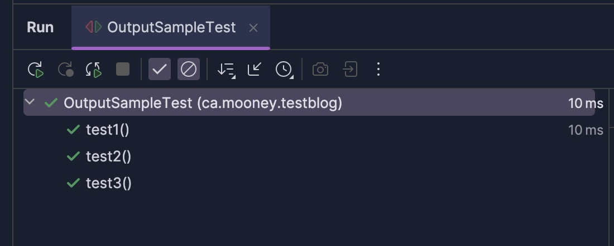
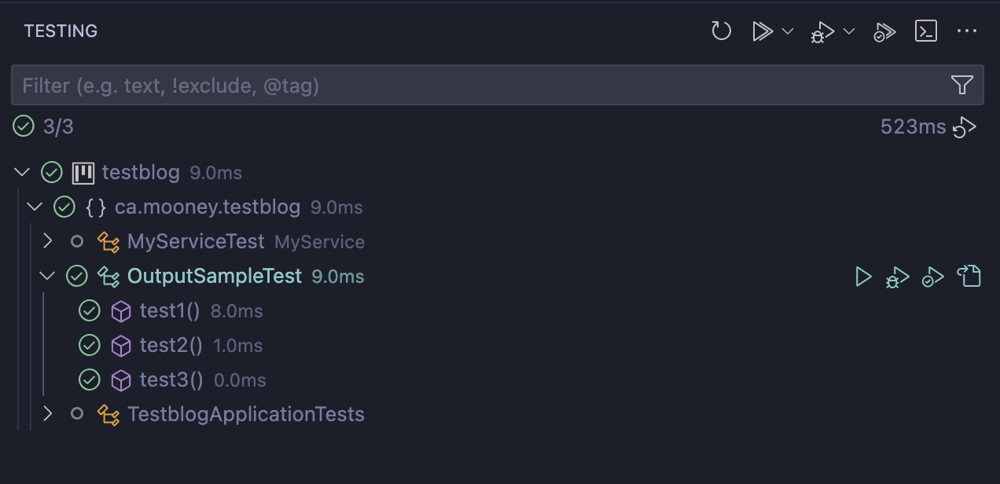
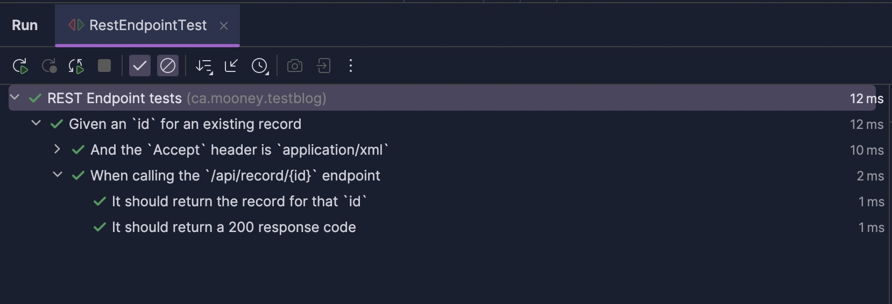

# Enhancing the Developer Experience of Testing

One overlooked aspect of testing is
the developer's experience is when running tests. Particularly the next developer's experience, whether that be a different
person, or future you who has just come back to some area of the code that you have not worked with in awhile. It may also be
 current you practicing [Test Driven Development (TDD)](https://martinfowler.com/bliki/TestDrivenDevelopment.html), and you need to organize your 
thoughts around what and how to test. Many times
we run these tests, we can be confident that nothing broke but the test output is incomprehensible! We aren't 
really sure what's supposed to be happening, or if it's safe to change anything. Or worse, something breaks, and we're not sure what the test was supposed to be doing, to get back to a working state. Let's see if we can fix that!

## Prioritizing the Test Output

One of the pillars of writing good tests is to make the test output look good for human eyes. We want it to be 
self affirming documentation of the expected behaviours of the various units of the system, as well as the 
behaviours of the system in general. 
This may seem obvious, but the statement I'm trying to make here is that the test code itself is **not 
good enough** to explain what's happening. It's not good enough for a couple of reasons. The first being, that it 
significantly slows developers down
having to read the test code. The second is that the test code does not express meaning and intentions. 
Looking at the sample inputs and outputs that the test uses is not enough to explain what's going on.

So how do we know if we have good output? We just look at it. Various IDEs and other test runners usually provide some 
kind of test output report, this is what we're aiming to make look good.


*Example IntelliJ Test Run Output*



The rest of this post will cover tips for how to make this output look good.

## Human Readable Test Descriptions
Depending on your test framework, this is may be a no-brainer. NodeJS testing frameworks, RSpec, and most 
styles of [Kotest](https://kotest.io/docs/framework/framework.html)
all have a required space for you to write real, human-readable sentences right into the test and their test contexts. 
This makes their output quite legible. 

```javascript
describe('MyClassUnderTest', () => {
  test('Given an `id` for an existing record, when `deleteById` is called, then the record is deleted from the DB', () => {
    // test code here
  });
});
```
The above results in nice output like this:

*Example NodeJS Test output*

Other method based test frameworks like JUnit and TestNG don't require this, and its led to these awful 
[conventions](https://enterprisecraftsmanship.com/posts/you-naming-tests-wrong/)
of writing out descriptions of tests as the method name with mixes of camel and snake case. Eg,

```java
@Test
void givenAnIdForExistingRecord_whenDeleteByIdCalled_thenRecordIsDeletedFromDB() {
    // test code here
} 
```

This is barely human-readable. 
It's hard to pick out the methods and inputs involved from the rest of the test verbiage. When
viewing many of these test methods together, they're difficult to pick out from each other. It's an eyesore. 
Nowhere in life do we need to read sentences that look like this, so we shouldn't need to read tests like this either.

Fortunately these test frameworks usually have a way to add a description to the test. 
For example, In JUnit, you can use the `@DisplayName` annotation to write normal sentences. Or TestNG has
`@Test(name="...some name... ")`. If we're using this kind of testing framework then we should ALWAYS use these kinds of annotations. And then it doesn't really matter what the method name is.

An improved example of the test above:
```java
@Test
@DisplayName("Given an `id` for an existing record, when `deleteById` is called, then the record is deleted from the DB")
void testDeleteById1() {
    // test code here
}
```

This will give us a nice human readable output in the test report, just like the NodeJS Test above.

## Structured Testing

Another tool that can help make our test output look good is to take advantage of the test frameworks ability to group
tests within a nesting of "contexts". This helps us create reusability in the test code, but more importantly in the test
sentence structure. Imagine we have these 3 [flat] tests for a REST endpoint:

- Given an \`id\` for an existing record, when calling the \`/api/record/{id}\` endpoint, it should return the record for that \`id\`
- Given an \`id\` for an existing record, when calling the \`/api/record/{id}\` endpoint, it should return a 200 response code
- Given an \`id\` for an existing record, and the \`Accept\` header is \`application/xml\`, when calling the \`/api/record/{id}\` endpoint, 
it should return the record for that \`id\` in XML format

In this example there are two problems: We're repeating the same setup over and over again, and the test descriptions are
becoming verbose run-on sentences. Structured testing can help solve this problem. We can group these tests into nested contexts
like so:

- Given an \`id\` for an existing record
  - When calling the \`/api/record/{id}\` endpoint
    - It should return the record for that \`id\`
    - It should return a 200 response code
  - And the \`Accept\` header is \`application/xml\`
    - When calling the \`/api/record/{id}\` endpoint 
      - It should return the record for that \`id\` in XML format

Resulting in the following output:

*Notice the expand/collapse controls that can help narrow down on the specific cases you may be interested in*

This definitely looks cleaner. One could argue that this deviates from a natural language sentence structure, or that
there's extra cognitive load in having to piece together the full declaration of a single test from its setup, to execution, to expectation.
This might be true, but in the first example with the flattened test structure we also have an arguably poor sentence structure given that they verge on run on sentences. So, there may be just as much mental load grouping the tests together which share the same contexts. So in that
sense it's a wash. But from a visualization, and organization standpoint, providing a structure like this is the clear winner.

In JUnit this can be accomplished using the `@Nested` annotation:

```java
@DisplayName("REST Endpoint tests")
class RestEndpointTest {

  @DisplayName("Given a valid `id`")
  @Nested
  class GivenValidId {

    @DisplayName("When calling the `/api/record/{id}` endpoint")
    @Nested
    class WhenCallingRecordEndpoint {

      @DisplayName("It should return the record for that `id`")
      @Test
      void testRecordReturned() {
        // test code here
      }

      @DisplayName("It should return a 200 response code")
      @Test
      void test200Response() {
        // test code here
      }
      
      // ... other tests
    }
  }
}
```

Structured testing isn't always mandatory. Sometimes a unit is simple enough that its tests can be written out in a flat
list. But more often then not, I find that for the sake of readability and organization, it's necessary to introduce some
kind of structure.

## Conclusion

Enhancing the developer experience when running tests is essential for maintaining a robust and efficient development process. 
By focusing on clear and comprehensible test output, we can ensure that both current and future developers can easily understand the purpose and results of tests. 
This clarity not only aids in debugging and maintaining the code but also promotes confidence in making changes and improvements. 
Well-written tests serve as valuable documentation and a safety net, making the development process smoother and more reliable. 
Invest time in writing meaningful tests and making their output as informative as possible.